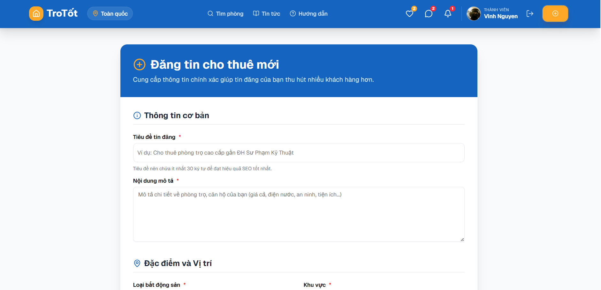

# 🏠 TroTốt (Homely) - Nền tảng Thuê phòng & Bất động sản hiện đại

TroTốt là một nền tảng tìm kiếm và đặt phòng trọ, căn hộ hàng đầu, được thiết kế với giao diện hiện đại, tối ưu trải nghiệm người dùng. Dự án giải quyết bài toán kết nối giữa người thuê và chủ nhà một cách nhanh chóng, an toàn và minh bạch.

---

## 📸 Giao diện dự án

| Trang chủ (Tìm kiếm) | Tin tức & Xu hướng | Chi tiết phòng & Đặt chỗ |
| :---: | :---: | :---: |
|  |  |  |

---

## ✨ Tính năng nổi bật

### 📱 Người dùng (Guest)
- **Tìm kiếm thông minh**: Bộ lọc đa năng theo khu vực, loại hình và tiện ích.
- **Bản đồ tương tác**: Xem vị trí phòng trực quan qua Leaflet Maps.
- **Yêu thích & Lưu trữ**: Quản lý danh sách Wishlist cá nhân.
- **Đặt phòng nhanh chóng**: Quy trình đặt chỗ mượt mà với thông tin minh bạch.
- **Đánh giá hệ thống**: Hệ thống feedback và rating tin cậy.

### 🏠 Chủ nhà (Host)
- **Đăng tin chuyên nghiệp**: Trình quản lý tin đăng tích hợp upload ảnh Cloudinary.
- **Quản lý vận hành**: Theo dõi đơn đặt phòng, quản lý trạng thái phòng trống.
- **Tương tác trực tiếp**: Hệ thống Chat real-time giúp giải đáp thắc mắc khách hàng ngay lập tức.

### 💬 Real-time & Security
- **Chat Socket.io**: Nhắn tin thời gian thực ổn định và bảo mật.
- **Thông báo đẩy**: Cập nhật thông tin mới nhất qua hệ thống Notification.
- **Bảo mật nâng cao**: Sử dụng JWT với cơ chế Access & Refresh Token, bảo mật mật khẩu bằng Bcrypt.

---

## 🚀 Công nghệ sử dụng

| Layer | Công nghệ |
| :--- | :--- |
| **Frontend** | React 19, Vite, Tailwind CSS v4, Zustand, Axios |
| **Backend** | Node.js, Express 5, Socket.io |
| **Database** | MongoDB Atlas, Mongoose |
| **Infrastructure** | Cloudinary (Images), Vercel (Frontend), Render (Backend) |
| **Tooling** | pnpm (Workspace), ESLint, PostCSS |

---

## 🛠️ Cài đặt và Chạy thử (Local)

### 1. Yêu cầu
- **Node.js**: v18+ 
- **pnpm**: v9+ (Khuyến nghị)

### 2. Các bước thực hiện
```bash
# Clone project
git clone https://github.com/yourusername/homely_project.git
cd homely_project

# Cài đặt dependencies cho toàn bộ workspace
pnpm install

# Cấu hình biến môi trường (.env)
# Copy .env.example sang .env trong thư mục /backend và điền các key cần thiết
```

### 3. Khởi chạy
```bash
# Chạy cả Frontend và Backend (Sử dụng pnpm filter)
pnpm --filter backend dev
pnpm --filter frontend dev
```

---

## 🌐 Triển khai (Deployment)

Dự án được tối ưu để triển khai trên các nền tảng Cloud:
- **Frontend**: [Vercel](https://vercel.com) (Tự động nhận diện pnpm workspace).
- **Backend**: [Render](https://render.com) (Cấu hình `ENABLE_PNPM=true` trong Environment Variables).

---

## 📄 Giấy phép
Project này được phát hành dưới bản quyền **MIT License**.

---
*Dự án được phát triển bởi **Vinh Nguyen** - 2024*
