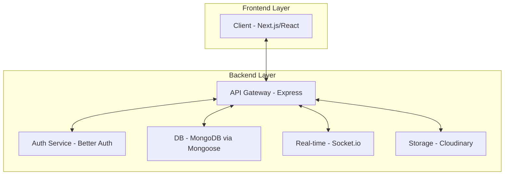

# Project Architecture - Homely Modern

The modern Homely project follows a **Decoupled Client-Server Architecture** with a strong emphasis on type safety and visual excellence.

## 🏗️ Overall Structure

## 📂 Directory Layout

### Frontend (`/frontend`)
- `/components`: Atom, Molecule, Organism structure. Includes `21st.dev` and `shadcn` components.
- `/hooks`: Custom React hooks for logic reuse.
- `/store`: Zustand stores for global UI state.
- `/services`: TanStack Query hooks and Axios instances.
- `/styles`: Global CSS (Tailwind v4) and design tokens.
- `/types`: Shared TypeScript interfaces.

### Backend (`/backend`)
- `/src/controllers`: Request handlers.
- `/src/middleware`: Auth, validation, and security guards.
- `/src/models`: Mongoose schemas and MongoDB aggregations.
- `/src/routes`: Express route definitions.
- `/src/sockets`: Socket.io events and namespaces.
- `/src/utils`: Helper functions and configuration.
- `/prisma`: (Removed - Using Mongoose schemas instead).

## 🔄 Data Flow
1. **Request**: Frontend sends a request via TanStack Query.
2. **Validation**: Backend validates inputs using Zod.
3. **Auth**: Better Auth verifies the session/token.
4. **Processing**: Controller interacts with MongoDB via Mongoose.
5. **Response**: Type-safe JSON response sent back to the client.
6. **Updates**: Real-time changes pushed via Socket.io if necessary.
